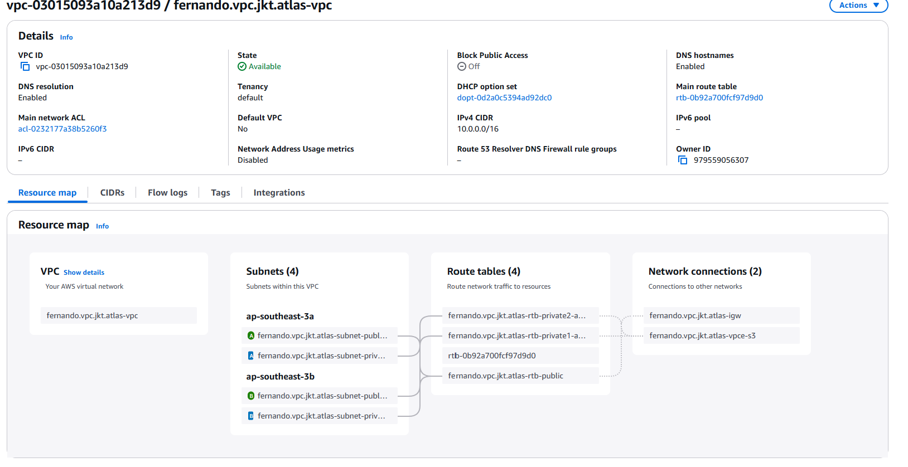
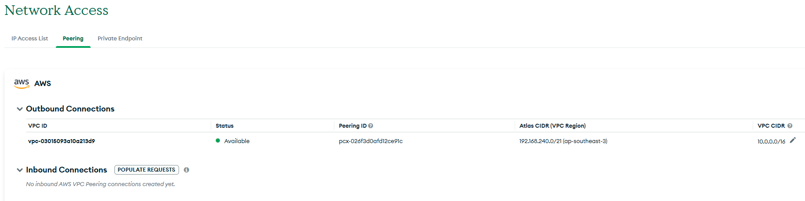
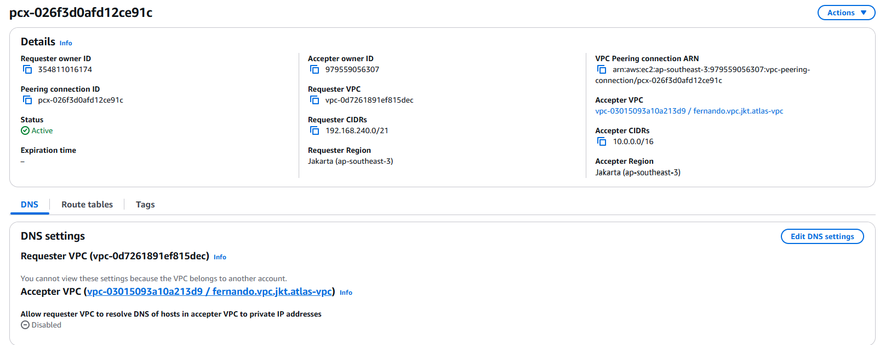
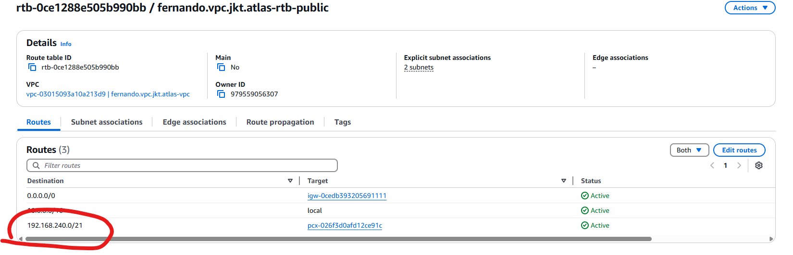
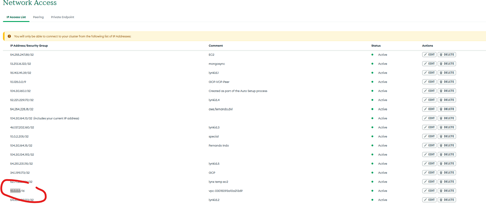
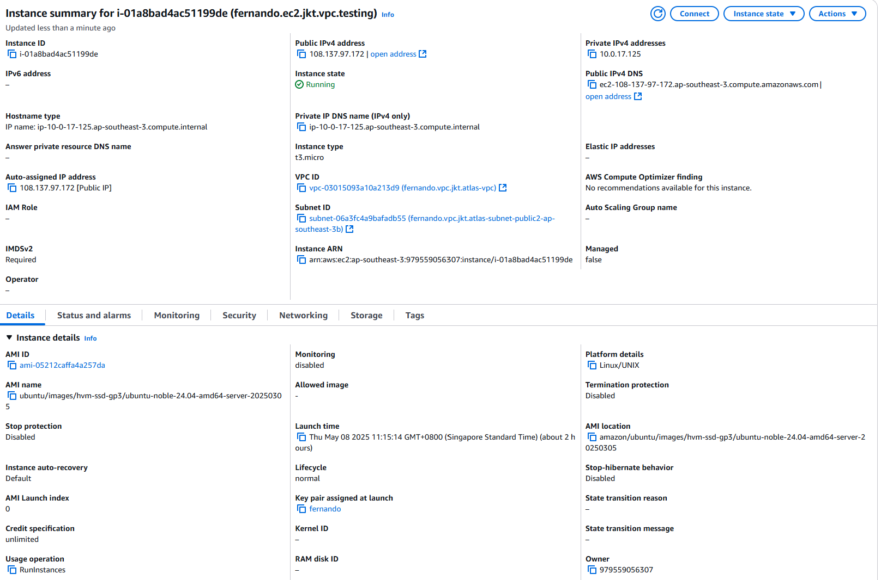
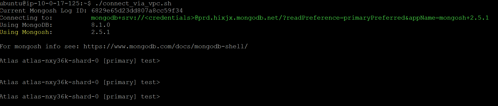

# AWS VPC Peering

## Create VPC in JKT Region

https://ap-southeast-3.console.aws.amazon.com/vpcconsole/home?region=ap-southeast-3#VpcDetails:VpcId=vpc-03015093a10a213d9

## Create Atlas Network Peering

https://cloud.mongodb.com/v2/67a960a798cb747a519a8acb#/security/network/peering

## Approve Peering Connections

https://ap-southeast-3.console.aws.amazon.com/vpcconsole/home?region=ap-southeast-3#PeeringConnectionDetails:VpcPeeringConnectionId=pcx-026f3d0afd12ce91c

## Update Route Table

https://ap-southeast-3.console.aws.amazon.com/vpcconsole/home?region=ap-southeast-3#RouteTableDetails:RouteTableId=rtb-0ce1288e505b990bb

Add new routing

## Allow 10.0.0.0/16 into the Atlas Project Network Access

https://cloud.mongodb.com/v2/67a960a798cb747a519a8acb#/security/network/accessList

## Test VPC from EC2

https://ap-southeast-3.console.aws.amazon.com/ec2/home?region=ap-southeast-3#InstanceDetails:instanceId=i-01a8bad4ac51199de

Connect using MongoSH

